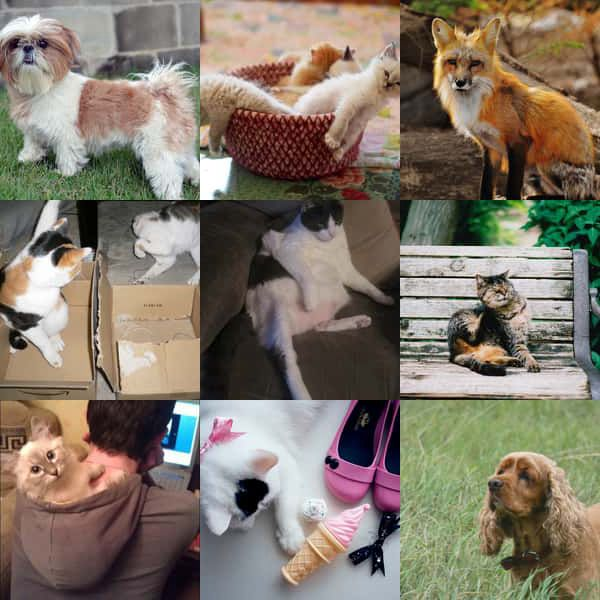

# Click the fox

This is a game in that you should click on the foxes in 30 minutes as much as you can.

## Architecture

The game consists of two applications: client and server. Both of them were developed by **TypeScript** and this is a custom server-side rendered **React** application.

### Client

The client application is a **React** application that handles the UI of our game.

### Server

A **Node.js** and **Express.js** application.

## What is the solution for a fast and smooth gameplay experience?

I created a service to retrieve photos from the APIs and resize them. Then I created an image sprite from them. The reason is that instead of the user downloading 9 photos each time, it only downloads 1 photo, and by different coordinates, the user can see each different photo. An example:

And during the gameplay, we fetch some photos ahead, to the user does not see any loading or wait.

## How it works

When the user clicks on Play, after completing the form and entering the name, the client sends a request to route `api/photos` to take the photos that be shown to the user and he/she should click on the photos and gain score.

The photos fetching mechanism:

- At first, the `photos.controller.ts` check if we have already some photos or not (check the path of `public/photos`). The number of files is based on the `MAX_FILE_COUNT_CACHED` environment variable. If we have enough files, then we just generate an image sprite.
- If we don't have enough files, then we run the `crawl-photos.ts` service, to fetch some photos for our application. After fetching each photo, we resize them and reduce their sizes by the `sharp` package and finally, we save the photo.
- When photos are crawled, we run our `image-sprites.ts` service to generate an image sprite of already downloaded photos. Then when we create the image sprite, we send it back as a `JSON` to the client with the file URL and coordinates of each photo on our image sprite.

## How to run:

- Node.js version **14.18.0** above and `yarn` is required.

- run `yarn install`
- run `yarn dev`
- now visit `http://localhost:3000` or `http://127.0.0.1:3000/`
